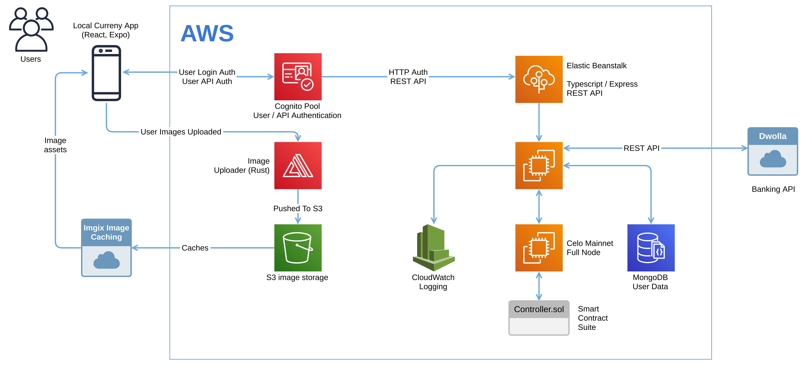

# local-currency-core


An Express web server to support on-chain interaction with local-currency contracts and mobile application.

This project is very tighly coupled with United States [payments solution provider Dwolla](https://dwolla.com) and AWS Cognito as a authentication provider, and in practicality will not operate as a stand-alone solution. The project is assumed to be operating on AWS, although various services are modular enough to swap out for other configurations. This project would work well in a containerized environment and a basic `Dockerfile` exists in the root directory.

This project requires the Truffle artifacts of the matching smart contract suite in repository https://github.com/humanity-cash/local-currency-contracts to be copied into the `src/service/contracts/artifacts` folder before any tests or execution will work, and a connection to a full-node or third-party archive node provider. (In local testing, provide your own `ganache` node to connect to.)

Finally, this project connects to a MongoDB compatible database defined in the environment settings for stored state that isn't recorded on-chain. (In test, an in-memory equivalent is provided.)

## Architecture Overview




## Install
```
nvm use 12
yarn --ignore-engines
```
## Testing
### Dependencies
* A `dotenv` file for test called `.env.test`
* Install `ganache-cli` instance:
```
npm install -g ganache-cli
```
### Test execution
* First, in a separate terminal run `ganache-cli` with the mnemonic matched in the `.env.test` file, for example:
```
npx ganache-cli -m "test test test test test test test test test test test fake"
```
* Then run the yarn task for the suite you want to test. Coverage task is available with the same options.

| Area                     | Command               |
| -------------            | --------------------- |
| Smart contracts only     | `yarn test:contracts` |
| Full server endpoints    | `yarn test:server`    |
| Database                 | `yarn test:db`        |
| ALL...                   | `yarn test`           |

_Note_ Check `package.json` for all the test options (greatly expanded over the duration of the project)

## Styling
```
yarn prettier
```
## Automation
* `../.github/workflows/build-api.yml` script will build and deploy to a local ganache instance in the GitHub runner to perform unit tests.

## API
### Swagger detailed definition
* https://app.swaggerhub.com/apis/Humanity.Cash/local-currency/1.0.1
* Additionally exported and available in the `/docs/` folder
* _Note_ This Swagger definition is partially out of date and needs to be updated

### API Summary

| HTTP | Path                  | Usage                                          
| -----| --------              | ---------------------                          
| GET  | /health               | API health information                         
| GET  | /stats/deposit        | Get all deposits                               
| GET  | /stats/withdrawal     | Get all withdrawals                            
| GET  | /stats/transfer       | Get all transfers                              
| GET  | /stats/operator       | Get aggregated operator statistics  
| GET  | /stats/users           | Get all user information           
| GET  | /users                | Get all users                                  
| GET  | /users/:id            | Get single user                                
| GET  | /users/:id/deposit    | Get deposits for a single user                 
| GET  | /users/:id/withdrawal | Get withdrawals for a single user              
| GET  | /users/:id/transfer   | Get transfers for a single user   
| GET  | /users/:id/funding-sources | Get funding sources (bank accounts) for a user
| GET  | /users/:id/notifications | Get notifications (for display in mobile app) for a user
| DELETE | /users/:id/notifications/:notificationId | Close a notification 
| GET  | /businesses           | Get all business users
| GET  | /content              | Get all content for the featured business and home screen 
| POST  | /users/               | Create a new wallet/user     
| POST  | /users/:id/customer   | Add a customer to an existing business-only account
| POST  | /users/:id/business   | Add a business to an existing customer-only account
| PUT   | /users/:id/customer/profile | Update customer profile 
| PUT   | /users/:id/business/profile | Update business profile
| POST  | /users/:id/upload/profilePicture | Update user profile picture
| POST  | /users/:id/cache/profilePicture | Clear cached profile picture on Imgix                 
| POST  | /users/:id/deposit    | Create a deposit for a wallet                 
| POST  | /users/:id/withdrawal | Create a withdrawal for a wallet              
| POST  | /users/:id/transfer   | Create a transfer between two wallets   
| POST  | /users/:id/iav-token  | Retrieve a new Instant Account Verification token from Dwolla
| POST | /users/:id/verify-micro-deposits | Verify micro-deposits for a user during bank account linking (IAV) process      
| POST  | /admin/pause          | Pause the contract suite                      
| POST  | /admin/unpause        | Unpause the contract suite                    
| POST  | /admin/transfer/controller  | Transfer ownership of the controller contract 
| POST  | /admin/transfer/user        | Transfer ownership of a user/wallet           
| POST  | /webhook/             | Hosted endpoint for Dwolla to post messages to       

## Environment variable configuration

The following environment variables are expected to be set for the project. In local test, provide these by a `.env.test` file. In a deployed environment, supply these with AWS Secrets manager or another method of injecting environment variables. In this repository, these values are stored as GitHub secrets so the GitHub Actions workflow can complete the full test suite with all variables configured.

| Variable            | Example           | Usage                                                                       |
| -----------------   | ----------------- | --------------------------------------------------------------------------- |
| USE_MANAGED_SECRETS | "true" / "false"  | Whether or not to pull environment variables and secrets from AWS Secrets Manager rather than directly injected into the environment. |
| DEBUG | "true" / "false" | True to output logging to console |
| NODE_ENV | "prod" / "test" | It set to anything other than "prod", API authentication will be turned off |
| LOCAL_CURRENCY_PROVIDER | "web3" / "kit" | Whether to use web3 or Celo contractkit as the web3 / smart contract orchestrator. Leave it at "web3". |
| LOCAL_CURRENCY_RPC_HOST | "http://localhost:8545" / "..." | Full archive node to connect to. If running test locally, connect to your ganache instance at `localhost` |
| LOCAL_CURRENCY_ADDRESS | "" / "0x8210b17B...617" | If in test, leave blank, the test scripts will deploy the contracts and set this itself. In a deployed environment, set it to the deployed address of the `Controller.sol` |
| LOCAL_CURRENCY_MNEMONIC | "test test test test test test test test test test test fake" | Mnemonic which deploys and becomes the owner of the smart contracts during test |
| LOCAL_CURRENCY_MNEMONIC_INDEX | "0" / "1"..."N" | Index of the account to deploy and own the test smart contract suites |
| NUMBER_OPERATORS | "2" | The system is currently configured for two participating local banks to act as the omnibus dollar holders |
| OPERATOR_1_DWOLLA_USER_ID | "fffaa122-11111-cdeb8-555bb11f" | Pre-configured Dwolla user ID representing a verified account
| OPERATOR_1_MNEMONIC | "test test test test test test test test test test test fake" | Mnemonic this participating local bank uses to interact with `Controller.sol`. Currently, the project is configured to use a single owner account for both participating banks. |
| OPERATOR_1_MNEMONIC_INDEX | "0" | Mnemonic index of the participating bank's account |
| OPERATOR_1_DISPLAY_NAME| "Participating Local Bank A" | Display name of the participating bank |
| OPERATOR_2_DWOLLA_USER_ID | "fffaa122-22222-cdeb8-555bb11f" | Pre-configured Dwolla user ID representing a verified account
| OPERATOR_2_MNEMONIC | "test test test test test test test test test test test fake" | Mnemonic this participating local bank uses to interact with `Controller.sol`. Currently, the project is configured to use a single owner account for both participating banks. |
| OPERATOR_2_MNEMONIC_INDEX | "0" | Mnemonic index of the participating bank's account |
| OPERATOR_2_DISPLAY_NAME| "Participating Local Bank B" | Display name of the participating bank |
| DERIVATION_PATH | "m/44'/60'/0'" | Derivation path to use when adding accounts from mnemonic phrases. Note that Celo has a different derivation path to Ethereum. |
| CUSTOMER_WITHDRAWAL_BALANCE_LIMIT | "5" | Private customers (non-businesses) may only withdraw their local currency and convert back to US dollars if their balance is below this amount. Set to $5. |
| AWS_POOL_ID | "us-west-1_fffdddee" | AWS Cognito pool ID to be used for authentication. |
| AWS_CLIENT_ID | "ffffeeeaaa111222999" | AWS Cognito client ID to be used for authentcation. |
| AWS_REGION | "us-west-1" | AWS Region for the AWS Cognito pool. |
| AWS_TOKEN_TYPE | "access" |  Authentication key type for AWS Cognito | 
| DWOLLA_BASE_URL | "https://api-sandbox.dwolla.com/" | Base URL for the Dwolla API calls used in this project |
| DWOLLA_APP_KEY | "sdflkjlDHlk1345kjlkdnMAAALkjj12002" | Application key for Dwolla API calls |
| DWOLLA_APP_SECRET | "455098fjuhhXCklkhdV3335T7xSZIl" | Application secret for Dwolla API calls |
| DWOLLA_ENVIRONMENT | "sandbox" / "production" | Using a sandbox Dwolla account allows test cases to simulate some off-chain activities (notably: simulate ACH processing) |
| WEBHOOK_SECRET | "000000000...0001" | Register a Dwolla webhook with this secret, which will be used by Dwolla to sign POSTs to the `/webhook` endpoint for security. See https://developers.dwolla.com/guides/webhooks/validating-webhooks for details |
| REGISTER_WEBHOOK    | "true" / "false"  | Whether or not to register a webhook with the Dwolla API. Registering a webhook deletes all previously existing webhooks |
| SIMULATE_WEBHOOK    | "true" / "false"  | Whether or not to simulate webhook behaviour in development or test. Mutually exclusive with REGISTER_WEBHOOK |
| SIMULATE_BANKING    | "true" / "false"  | Whether or not to process fake banking (ACH) records in the Dwolla sandbox environment. Only relevant for sandbox |
| DELETE_PRIOR_WEBHOOK    | "true" / "false"  | Whether or not to delete any previously registered webhooks for this project on startup |
| TRANSFER_RECONCILE_ON_STARTUP    | "true" / "false"  | Whether or not run the deposit reconciliation batch process on startup. This batch loops through all deposits and checks the status our database and Dwolla's API, minting any completed deposits if required. This should only ever have to mint deposits if a webhook was not correctly received to process the deposit normally. |
| CUSTOMER_DEFAULT_AVATAR_URL | "" | Default avatar for new users, currently set to blank string (default avatar is configured on Imgix instead) | 
| BUSINESS_DEFAULT_AVATAR_URL | "" | Default avatar for new users, currently set to blank string (default avatar is configured on Imgix instead) | 
| IMGIX_PROFILE_PICTURE_URL | "https://profile-picture-user.imgix.net/" / "https://((yourproject)).imgix.net" | Imgix collection endpoint that caches and managed user profile pictures |
| IMGIX_PURGE_API | "https://api.imgix.com/api/v1/" | Imgix API endpoint |
| IMGIX_API_TOKEN | "ak_310734l5bbbbdddaaafffeee477878sdf" | Imgix API token |
| MONGO_DB_USER | "root" | Username for MongoDB to connect to. In test this will be ignored and an emphemeral in-memory MongoDB used instead |
MONGO_DB_PASSWORD | "sdflkjsd0809sdlfkjsl13" | MongoDB password |
MONGO_URL | "mongodb://sample.cluster.amazonaws.com:27017/" | MongoDB URL | In test this will be ignored and an emphemeral in-memory MongoDB used instead |
USE_MONGO_TLS | "true" / "false" | Whether or not to use TLS when connecting to a remote MongoDB cluster. In AWS, the public certificate `rds-combined-ca-bundle.pem` (included in this repository) is used |

### Appendix A
There is a manual `yarn` task `"patch-dwolla-v2": "cp src/utils/index.d.ts.patch node_modules/dwolla-v2/src/index.d.ts"` which copies a patched version of the `dwolla-v2` Typescript index file, which was missing some definitions around access token management. This should be suggested as an upstream patch to the `dwolla-v2` Node package.

### Appendix B
If using managed secrets (i.e. via AWS Secrets Manager) you must always manually supply the following variables to your environment:
```
AWS_SECRET_REGION: "secret region"
SECRET_NAME: "YOUR SECRET NAME"
USE_MANAGED_SECRETS: true
AWS_REGION: "wwwwwwwwwww"
AWS_CLIENT_ID: "xxxxxxxxxxxxxxxxxx"
AWS_POOL_ID: "yyyyyyyyyyyyy"
AWS_TOKEN_TYPE: access
```
In a containerized environment these could be injected environment variables at runtime, or a Kubernetes secret.

The execution environment (in this implementation, an Elastic Beanstalk role) must have read access to the named secret.

The Cognito client and pool must always be supplied because API header authentication is instantiated as a middleware on the Express server, and is one of the first modules to be read and processed in the project (before the managed secrets are parsed).

### Appendix C

`rds-combined-ca-bundle.pem` is a public certificate used by AWS for database cluster TLS connections and is provided here for simplicity when (as in this implementation) using TLS with MongoDB.
